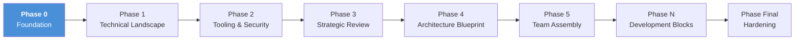

# Ignite

**Complete development infrastructure for Claude Code.** One command. Any stack. Full workflow.

<!-- GitHub About: Complete development infrastructure for Claude Code projects. Project scaffolding, session memory, quality gates, security screening, CI/CD — auto-adapted to any stack. Works on new and existing codebases. -->
<!-- Topics: claude-code, agent-skills, workflow-methodology, development-workflow, compound-engineering, security, multi-stack, automation -->


You start a project with Claude Code. You get code — but no structure around it. No quality gates, no memory between sessions, no security checks. Context gets lost after every `/clear`. Mistakes repeat.

Ignite gives your project the infrastructure it's missing. One command sets up project memory, quality gates, security screening, CI/CD, and specialized agents — all adapted to your stack. It handles the complex parts so you can focus on building.

## Table of Contents

- [Quick Start](#quick-start)
- [Workflow Overview](#workflow-overview)
- [What You Get](#what-you-get)
- [How It Works](#how-it-works)
- [The 8 Phases](#the-8-phases)
- [What Gets Generated](#what-gets-generated)
- [Stack Detection](#stack-detection)
- [Adaptive UX](#adaptive-ux)
- [Requirements](#requirements)
- [Post-Setup](#post-setup)
- [Comparison](#comparison)
- [FAQ](#faq)
- [Limitations](#limitations)
- [Technical Details](#technical-details)
- [Project Values](#project-values)
- [Contributing](#contributing)
- [Changelog](#changelog)
- [License](#license)
- [Acknowledgments](#acknowledgments)

## Quick Start

> [!TIP]
> Copy the `Ignite/` folder into your project root, then run:

```bash
/project-workflow-init
```

The skill auto-detects your OS, stack, and existing configuration. Most values resolve automatically — you answer 0–5 questions depending on your experience level.

<details>
<summary>Step-by-step walkthrough</summary>

1. Copy the `Ignite/` folder into your project root
2. Open Claude Code in your project directory
3. Run `/project-workflow-init`
4. Answer the setup questions (most values auto-detected)
5. Done — full workflow infrastructure generated

</details>

## Workflow Overview



## What You Get

- **Workflow structure** — CLAUDE.md, docs, 5 specialized agents, context-aware rules — adapted to your stack
- **Quality gates** — automated typecheck + lint + test enforcement before every commit
- **Session memory** — mistakes are recorded and patterns graduate to permanent memory. Your Claude Code learns from past errors and gets better every session
- **Security framework** — Cerbero: supply-chain screening for Skills and MCP servers, known CVE detection, rug pull baseline checks
- **CI/CD pipeline** — GitHub Actions workflow generated and configured for your stack
- **Mid-way support** — detects existing code, CI/CD, and conventions — integrates without overwriting
- **Adaptive UX** — auto-detects experience level, adapts prompts, defaults, and output detail

> [!NOTE]
> Every technical decision is documented with context and alternatives. Information surfaces when you need it, not all at once. The goal is a better development experience, not just a faster one.

## How It Works

When you run `/project-workflow-init`, Ignite executes **Phase 0: Foundation** in 6 steps:

| Step | Name | What happens |
|------|------|-------------|
| 0 | Initialization | Detect language preference, determine experience level (Guided/Advanced) |
| 1 | Discovery | Scan OS, project files, existing config, analyze project context |
| 2 | Configuration | Auto-resolve values, select stack profile, ask questions adapted to level |
| 2.5 | Preview | Dry-run showing exactly what will be generated, with confirmation before writing |
| 3 | Generation | Process templates with 28 dynamic placeholders, respect overwrite categories |
| 4–5 | Finalization | Security framework, git init, validate docs, cleanup, summary |

## The 8 Phases

`/project-workflow-init` establishes Phase 0. The remaining phases guide your project from stack decisions to production:

| Phase | Purpose |
|-------|---------|
| 0. Foundation | Project memory, docs, agents, hooks, CI/CD |
| 1. Technical Landscape | Stack decisions, validation tools, ecosystem scan |
| 2. Tooling & Security | Evaluate and install skills/MCPs (via Cerbero) |
| 3. Strategic Review | Architecture assessment (enriched by installed tools) |
| 4. Architecture Blueprint | Detailed design based on actual capabilities |
| 5. Team Assembly | Configure agents, assign roles |
| N. Development Blocks | Build features iteratively with Ralph Loop |
| Final. Hardening | Security audit, performance, production readiness |

> [!IMPORTANT]
> Phase 2 (Tooling) runs before Phase 3 (Review) deliberately. This ensures architecture decisions are made with full knowledge of available tools — not speculative candidates.

## What Gets Generated

<details>
<summary>Full file tree — 28+ files across 10 categories (click to expand)</summary>

```
your-project/
├── .claude/
│   ├── agents/              # Specialized agents (user-selectable)
│   │   ├── Lorekeeper.md    # Documentation agent (always installed)
│   │   ├── Inquisidor.md    # Testing agent
│   │   ├── Sentinel.md      # Security agent
│   │   ├── backend-worker.md
│   │   └── frontend-worker.md
│   ├── rules/               # Context-aware rules (path-activated)
│   │   ├── compound-engineering.md
│   │   ├── debugging.md      # Prediction Protocol methodology
│   │   ├── documentation.md
│   │   ├── testing.md
│   │   └── styling.md       # Conditional: only if frontend UI detected
│   ├── hooks/               # Automation hooks (always generated)
│   │   ├── lorekeeper-session-gate.py    # SessionStart: context + version check
│   │   ├── lorekeeper-commit-gate.py     # PreToolUse: blocks commits without docs
│   │   ├── lorekeeper-session-end.py     # SessionEnd: checkpoint + graduation
│   │   └── code-quality-gate.py          # PreToolUse: typecheck + lint + test
│   ├── skills/cerbero/      # Security framework (optional)
│   ├── quality-gate.json    # Stack-specific quality commands
│   ├── ignite-version.json  # Version tracking for auto-update
│   └── settings.local.json  # Hook configuration (gitignored)
├── .github/workflows/
│   └── quality.yml          # CI/CD pipeline (adapted per stack)
├── docs/
│   ├── STATUS.md            # Project status (< 60 lines)
│   ├── DECISIONS.md         # Technical decisions (append-only)
│   ├── CHANGELOG-DEV.md     # Development changelog
│   ├── SCRATCHPAD.md        # Session learning log (< 150 lines)
│   ├── LESSONS-LEARNED.md   # Incident post-mortems
│   └── specs/               # Feature specifications
├── scripts/
│   └── validate-docs.sh     # Automated documentation validation
├── _workflow/guides/         # Permanent reference (kept after setup)
│   ├── workflow-guide.md
│   ├── agents-guide.md
│   └── Referencia-edicion-CLAUDE.md
├── CLAUDE.md                 # Project memory (< 200 lines)
└── README.md                 # Generated project README
```

</details>

## Stack Detection

Works with **any project type**. These stacks get optimized defaults (paths, test patterns, CI actions, security rules); all other projects use the Generic profile.

<details>
<summary>12 stack profiles with detection rules (click to expand)</summary>

| Profile | Detection | Backend Paths | Test Patterns | CI Action |
|---------|-----------|--------------|---------------|-----------|
| Python (Django) | `django` in deps | app/, views/, models/ | tests/, test_*.py | setup-python@v5 |
| Python (FastAPI) | `fastapi` in deps | app/, routers/, schemas/ | tests/, test_*.py | setup-python@v5 |
| Python (generic) | pyproject.toml / setup.py | src/, lib/ | tests/, test_*.py | setup-python@v5 |
| Rust | Cargo.toml | src/, lib.rs, main.rs | tests/, #[cfg(test)] | rust-toolchain@stable |
| Go | go.mod | cmd/, pkg/, internal/ | *_test.go | setup-go@v5 |
| Node/React | react/next/vue in deps | src/lib/, src/app/api/ | *.test.ts(x) | setup-node@v4 |
| Node/Express | express/fastify in deps | src/, routes/, middleware/ | *.test.ts | setup-node@v4 |
| Node (generic) | package.json | src/, lib/ | *.test.ts | setup-node@v4 |
| Java/Kotlin | pom.xml / build.gradle | src/main/java/ | src/test/java/ | setup-java@v4 |
| PHP (Laravel) | laravel in composer.json | app/, routes/, database/ | tests/ | setup-php@v2 |
| Ruby (Rails) | rails in Gemfile | app/models/, controllers/ | spec/, test/ | setup-ruby@v1 |
| **Any other** | **(fallback)** | **src/, lib/** | **tests/, test/** | **(manual config)** |

</details>

## Adaptive UX

Ignite adapts to your experience level automatically. The same analysis runs at every level — only the interaction density and presentation detail change.

| Aspect | Guided | Advanced |
|--------|--------|----------|
| Prompts | 0–2 questions | 4–5 questions |
| Defaults | Safe defaults, auto-applied | Full control over every option |
| Preview | Summary grouped by purpose | Detailed file-by-file view |
| Detection | Automatic from project signals | Automatic or manual override |

Level detection reads existing project signals (CLAUDE.md complexity, hook configurations, rule customizations, project maturity). If signals are inconclusive, the skill asks you directly.

> [!TIP]
> You can always switch levels. Guided users can request more detail during preview; Advanced users get streamlined defaults if they prefer.

## Requirements

- **Claude Code** installed and running
- **Python 3.8+** for automation hooks (stdlib only — no pip dependencies)
- **Git** initialized or available

> [!NOTE]
> **Windows:** Git for Windows must be installed. Ignite auto-configures `CLAUDE_CODE_GIT_BASH_PATH`.
> **macOS/Linux:** Python 3 available via `python3`. Verified automatically.

## Post-Setup

After `/project-workflow-init` completes, customize these project-specific sections:

1. **CLAUDE.md** — Fill in `Style` and `Architecture` sections
2. **Agents** — Adapt domain paths to your project layout
3. **Styling rule** — Define design tokens if applicable

Then proceed to Phase 1. Full guide: `_workflow/guides/workflow-guide.md`

## Comparison

| Feature | Ignite | claude-bootstrap | atlas-session | scaffolding |
|---------|:------:|:----------------:|:-------------:|:-----------:|
| Auto-detection | ++ | + | + | -- |
| Multi-language | ++ | -- | -- | -- |
| Mid-way integration | +++ | -- | -- | -- |
| Overwrite protection | +++ | - | ++ | -- |
| Supply-chain security | ++ | -- | -- | - |
| Compound engineering | ++ | -- | ++ | ++ |
| Hook-based enforcement | +++ | -- | -- | -- |
| Code quality gates | ++ | ++ | -- | +++ |
| CI/CD generation | ++ | ++ | -- | ++ |
| Doc validation | ++ | -- | -- | - |
| Adaptive UX (2 levels) | +++ | -- | -- | -- |
| Dry-run preview | ++ | -- | -- | -- |
| Minimal UX (0-2 prompts) | +++ | - | ++ | -- |
| Cross-platform | ++ | -- | + | + |

Legend: `+++` exceptional `++` good `+` basic `-` weak `--` absent

## FAQ

<details>
<summary>Does Ignite work on existing projects?</summary>

Yes. Ignite detects existing code, CI/CD configuration, and conventions. It integrates without overwriting your customizations. The 3-category overwrite system (merge docs, replace code, ask for rules/agents) protects your existing work.

</details>

<details>
<summary>Can I re-run /project-workflow-init?</summary>

Yes. Safe re-execution analyzes what has changed since the last run. Docs are merged (missing sections added), executable code is replaced if different, and customized files (rules, agents) prompt before modification.

</details>

<details>
<summary>What if I only want some components?</summary>

Ignite generates all components but each serves an independent purpose. You can delete any agent, rule, or hook after generation without breaking the rest. Cerbero installation is optional (you are asked during setup).

</details>

<details>
<summary>Does it work without internet access?</summary>

Phase 0 (Foundation) works fully offline — all templates are local. Phase 1's ecosystem scan and Phase 2's Cerbero CVE checks require internet access.

</details>

<details>
<summary>What languages are supported?</summary>

English, Spanish, Portuguese, and French for all generated documentation and interaction. Technical elements (file names, config keys, code) remain in English. You can also enter a custom language via free text input.

</details>

## Limitations

### What Ignite doesn't do
- **Not a substitute for thinking** — generates infrastructure, not architecture decisions
- **Phase time estimates are optimistic** — real architecture design takes longer than 15-30 min
- **No rollback** — if generation goes wrong, you delete and re-run (git history is your safety net)

### Cerbero security disclaimers

Cerbero is a **screening layer, not a security guarantee**. It catches common attacks but has real limits:

- **Detects:** known CVEs, obvious prompt injection phrases, dangerous shell commands, typosquatting, baseline changes in installed MCPs
- **Does NOT detect:** sophisticated prompt injection (synonyms/obfuscation bypass regex), zero-day vulnerabilities (24-48hr CVE database lag), silent data exfiltration, post-approval behavioral changes
- **mcp-scan integration is strongly recommended** — without it, you lose Snyk's tool poisoning detection and rely on regex alone

> [!CAUTION]
> For high-stakes environments, use Cerbero as one layer in a defense-in-depth approach, not your only protection.

## Technical Details

<details>
<summary>Skill architecture and complete feature reference (click to expand)</summary>

### Skill Architecture

The skill follows a **delegation pattern**: `SKILL.md` orchestrates the phases, while complex logic is delegated to reference files (`ref-*.md`). `file-map.md` serves as the single source of truth for all template-to-destination mappings and placeholder declarations.

```
.claude/skills/project-workflow-init/
├── SKILL.md                       # Orchestrator (Steps 0-5)
└── references/                    # Detailed logic (loaded on-demand)
    ├── file-map.md                # Template mapping + placeholders
    ├── ref-adaptive-ux.md         # Adaptive UX: detection, behavior tables, preview specs
    ├── ref-stack-profiles.md      # 12 stack profiles
    ├── ref-platform-detection.md  # OS/Python/Git detection
    ├── ref-generation-details.md  # Step 2.5 preview + Step 3 generation logic
    ├── ref-finalization-details.md # Step 5 detailed logic
    ├── ref-cerbero-installation.md # Security framework
    └── ref-error-handling.md      # Error recovery

.claude-plugin/plugin.json          # Standard plugin manifest
```

### Complete Feature Reference

| Feature | Description |
|---------|-------------|
| **6-step initialization** | Initialization, Discovery, Configuration, Preview, Generation, Finalization |
| **12 stack profiles** | Python (Django/FastAPI/generic), Rust, Go, Node (React/Express/generic), Java/Kotlin, PHP/Laravel, Ruby/Rails, Generic |
| **28 dynamic placeholders** | Auto-resolved from project config files (package.json, pyproject.toml, etc.) |
| **Mid-way integration** | Detects existing code, CI/CD, conventions — integrates without overwriting |
| **Overwrite protection** | 3-category system: A (merge docs), B (replace code), C (ask user) |
| **Compound engineering** | SCRATCHPAD graduation pipeline + cross-session persistence via hooks |
| **Cerbero security** | Supply-chain screening, known CVE detection, prompt injection patterns, rug pull baselines |
| **Code quality gates** | PreToolUse hook enforcing typecheck + lint + test before commits |
| **CI/CD generation** | GitHub Actions workflow template adapted per stack profile |
| **Hook-based enforcement** | 7 automated hooks: session lifecycle + commit gates + security validation |
| **Multi-language** | English, Spanish, Portuguese, French + free text |
| **Adaptive UX** | 2 levels (Guided/Advanced): auto-detects user experience, adapts questions, defaults, and output detail |
| **Dry-run preview** | Preview all generated files before writing — cancel, adjust, or confirm |
| **Minimal interaction** | 0-2 prompts (Guided) to 4-5 prompts (Advanced), level-adaptive |
| **Safe re-execution** | Smart overwrite analysis — re-run `/project-workflow-init` without losing customizations |
| **Debugging methodology** | Prediction Protocol: predict, observe, compare, explain, verify |
| **Post-mortem tracking** | Structured LESSONS-LEARNED.md with incident timeline and root cause analysis |
| **Auto-update notification** | Session-start version check with drift and age detection |
| **Graduation automation** | Automated detection of repeating SCRATCHPAD patterns across sessions |
| **Plugin manifest** | .claude-plugin/plugin.json — standard Claude Code plugin structure |

</details>

## Project Values

Three commitments shape every decision in this workflow.

**Transparency** — Every decision is documented with context and alternatives. Every rejected option has a reason on record. The user never has to guess why something was chosen.

**Timely, Adequate Information** — The right information at the right moment. Not everything at once (overload), not too late (surprise). Each phase surfaces what you need to decide now, and defers what you don't.

**Improved Experience** — Every automation, template, and gate exists to make development better — not just faster. Quality of the development experience is a first-class metric alongside code quality.

Complementary principles: Rigor (measurable exit conditions). Compound learning (every session builds on the last). Security-first (evaluate before install). Context economy (every token earns its place).

## Contributing

See [CONTRIBUTING.md](CONTRIBUTING.md) for architecture overview, how to add stack profiles, templates, hooks, and rules.

## Changelog

See [CHANGELOG.md](CHANGELOG.md) for version history.

## License

MIT License — see [LICENSE](LICENSE).

## Acknowledgments

This workflow builds on ideas and practices from:

**Methodologies**
- [Ralph Loop](https://ghuntley.com/loop) — the iterative execution pattern at the core of Development Blocks. Expanded by [vincirufus.com](https://vincirufus.com) and [paddo.dev](https://paddo.dev)
- [Compound Engineering](https://every.to/chain-of-thought/compound-engineering) — the plan/work/review cycle and session accumulation pattern. [Plugin](https://github.com/EveryInc/compound-engineering-plugin) by Every

**Practitioners**
- **Andrej Karpathy** (ex-Tesla AI Director, OpenAI founding member) — the shift from vibe coding to agentic engineering shaped Ignite's declarative approach (CLAUDE.md + rules instead of imperative scripts)
- **Boris Cherny** (Claude Code creator) — CLAUDE.md as mistake log and PostToolUse hooks directly inspired the SCRATCHPAD graduation pipeline and quality gates
- **Addy Osmani** (Google Chrome engineering lead) — spec-first development and task sizing informed the Phase 0 → Phase N workflow structure and block-based execution
- **Simon Willison** (Django co-creator) — his two-phase approach (research → production) influenced the separation between exploration phases (1-5) and development blocks (N)
- **Harper Reed** (former CTO, Obama 2012 campaign) — TDD as counter to hallucination shaped the Prediction Protocol debugging methodology and verification loops
- **paddo.dev** (Emergent Minds blog) — minimal effective structure, the 19-Agent Trap essay, and /compact timing research informed agent count decisions and context management
- **swyx** (Latent Space founder) — the IMPACT framework and conductor model influenced the multi-agent architecture and Lorekeeper's orchestration role

**Resources**
- [Claude Code docs](https://code.claude.com/docs) — best practices, agent teams, skills, MCP
- [Anthropic: Multi-Agent Research System](https://anthropic.com/engineering/multi-agent-research-system)
- [Anthropic: Effective Context Engineering](https://anthropic.com/engineering/effective-context-engineering)

---

Made by [Juan Puche](https://github.com/jppuche) — building tools that solve real problems and make complex things simpler.
